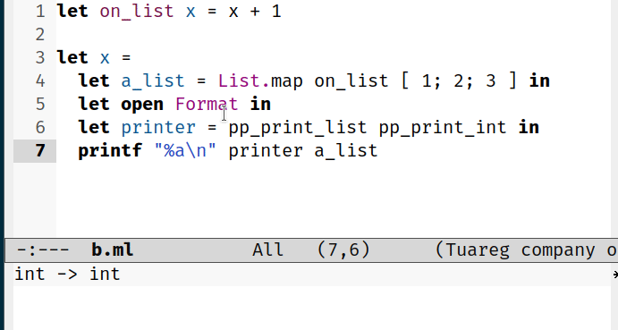
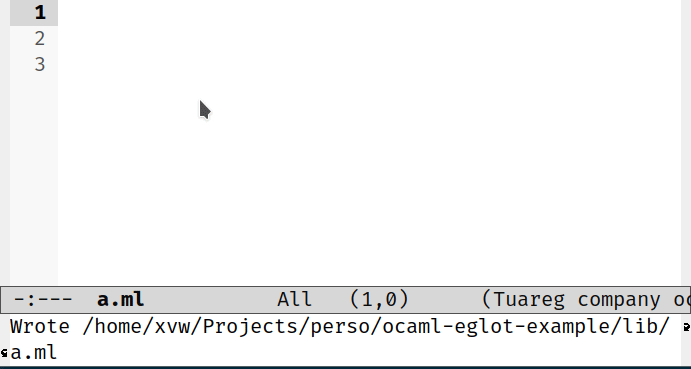

> [!WARNING]
> `ocaml-eglot` is **highly experimental** and at a very early stage
> of development. While we're very happy to collect user feedback,
> **don't overwhelm your OCaml development** environment just yet.

# ocaml-eglot

**`ocaml-eglot`** is a lightweight
[Emacs](https://www.gnu.org/software/emacs/) **minor mode** designed
to enhance the experience of writing OCaml code by leveraging the
[**Eglot**](https://www.gnu.org/software/emacs/manual/html_mono/eglot.html)
[Language Server
Protocol](https://microsoft.github.io/language-server-protocol/) (LSP)
client. This tool specifically caters to the OCaml ecosystem by
implementing canonical custom requests and commands exposed by the
[**`ocaml-lsp-server`**](https://github.com/ocaml/ocaml-lsp).

`ocaml-eglot` bridges the gap between generic LSP support and the
**specific needs of OCaml developers**. Its tight coupling with Eglot
ensures a lightweight experience without sacrificing the advanced
features made available by `ocaml-lsp-server`. Its aim is to offer a
user experience as close as possible to that offered by the Emacs mode
[Merlin](https://ocaml.github.io/merlin/editor/emacs/).

## Features

### Browsing errors

Eglot relies on
[Flymake](https://www.gnu.org/software/emacs/manual/html_node/emacs/Flymake.html)
for error diagnosis. OCaml-eglot offers two functions for quickly
navigating through errors:

- `ocaml-eglot-error-next` (<kbd>C-c</kbd> <kbd>C-x</kbd>): jump to
  the next error
- `ocaml-eglot-error-prev` (<kbd>C-c</kbd> <kbd>C-c</kbd>): jump to
  the previous error

### Type Enclosings

In `ocaml-eglot` one can display the type of the expression below the cursor and
navigate the enclosing nodes while increasing or decreasing verbosity:

- `ocaml-eglot-type-enclosing` (<kbd>C-c</kbd> <kbd>C-t</kbd>)
Display the type of the selection and start a "type enclosing" session.

During a "type enclosing" session the following commands are available:

- `ocaml-eglot-type-enclosing-increase-verbosity` (<kbd>C-c</kbd>
  <kbd>C-t</kbd> or <kbd>C-→</kbd>): to increase the verbosity of the
  type observed
- `ocaml-eglot-type-enclosing-decrease-verbosity` (<kbd>C-←</kbd>): to
  decrease verbosity of the type observed
- `ocaml-eglot-type-enclosing-grow` (<kbd>C-↑</kbd>): to grow the
  expression
- `ocaml-eglot-type-enclosing-shrink` (<kbd>C-↓</kbd>): to shrink the
  expression
- `ocaml-eglot-type-enclosing-copy` (<kbd>C-w</kbd>): to copy the
  type expression to the _kill-ring_ (clipboard)

### Jump to definition/declaration

OCaml-eglot provides a shortcut to quickly jump to the definition or
declaration of an identifier:

- `ocaml-eglot-find-definition` (<kbd>C-c</kbd> <kbd>C-l</kbd>): jump to
  definition (the implementation)
  
- `ocaml-eglot-find-declaration` (<kbd>C-c</kbd> <kbd>C-i</kbd>): jump to
  declaration (the signature)

The default calculation for the window containing the jump result is
_smart_: if the target is on the same file, the command uses the same
window; if the target is on another file, the command opens a new
window. Auxiliary functions for controlling the placement of a result
are provided:

- `ocaml-eglot-find-definition-in-new-window`
- `ocaml-eglot-find-declaration-in-new-window`
- `ocaml-eglot-find-definition-in-current-window`
- `ocaml-eglot-find-declaration-in-current-window`

The default behavior can also be configured using the
`ocaml-eglot-open-window-strategy` variable.

### Jump to type definition  of an expression

You can also jump to the type definition of the expression at point.

Auxiliary functions for controlling the placement of a result are
provided:

- `ocaml-eglot-find-type-definition-in-new-window`
- `ocaml-eglot-find-type-definition-in-current-window`

### Infer Interface

Used to infer the type of an interface file. If the buffer is not
empty, a prompt will ask for confirmation to overwrite the buffer
contents:

- `ocaml-eglot-infer-interface`: infer the interface for the current implementation file

### Find Alternate file

OCaml-eglot allows you to quickly switch from the implementation file
to the interface file and _vice versa_. If the interface file does not
exist, a prompt can be used to generate it (using type inference,
based on `ocaml-eglot-infer-inteface`):

- `ocaml-eglot-alternate-file` (<kbd>C-c</kbd> <kbd>C-a</kbd>): switch
  from the implementation file to the interface file and _vice versa_

### Get Documentation

Although the `Hover` primitive in the LSP protocol can be used to
conveniently display value documentation, it is also possible to query for it
specifically:

- `ocaml-eglot-document` (<kbd>C-c</kbd> <kbd>C-d</kbd>): documents
  the expression below the cursor.
- `ocaml-eglot-document-identifier`: enables you to enter an
  identifier (present in the environment) and return its
  documentation.

### Construct Expression

Enables you to navigate between the different typed-holes (`_`) in a
document and interactively substitute them:

- `ocaml-eglot-hole-next`: jump to the next hole
- `ocaml-eglot-hole-prev`: jump to the previous hole
- `ocaml-eglot-construct`: open up a list of valid substitutions to
  fill the hole

If the `ocaml-eglot-construct` command is prefixed by an argument, ie:
`C-u M-x ocaml-eglot-construct`, the command will also search for
valid candidates in the current environment:

### Source Browsing

OCaml-eglot allows you to navigate semantically in a buffer, passing
from an expression to the parent `let`, the parent `module`, the
parent `fun` and the parent `match` expression. It is also possible to
navigate between pattern matching cases:

- `ocaml-eglot-jump`: jumps to the referenced expression

### Search for values

Search for values using a _by polarity_ query or a type expression. A
polarity query prefixes the function arguments with `-` and the return
with `+`. For example, to search for a function of this type: `int ->
string`. Search for `-int +string`. Searching by polarity does not
support type parameters. A search by type (modulo isomorphisms) uses a
query closer to what you would write to describe a type. For example,
to find the function `int_of_string_opt`, search for `string -> int
option`:

- `ocaml-eglot-search` searches for a value by its type or polarity
  (the search type is defined by the input query)

