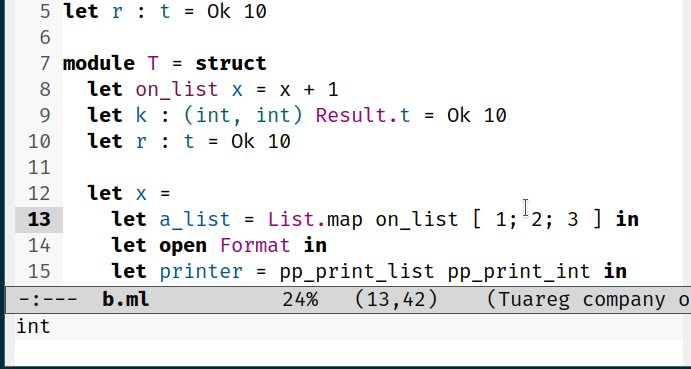
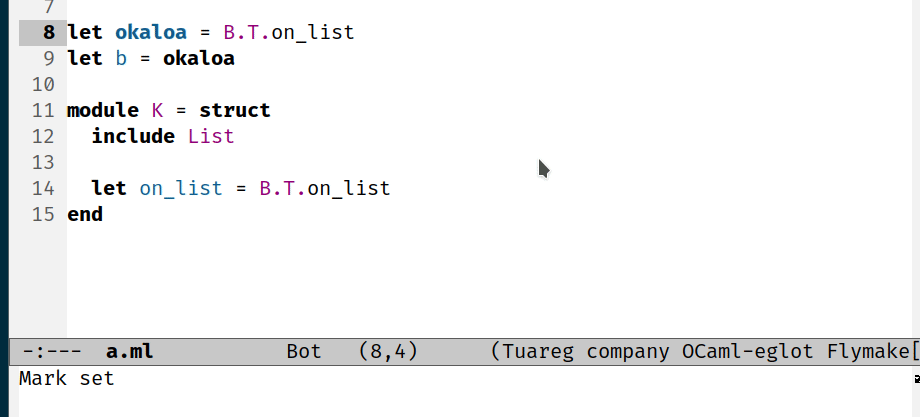
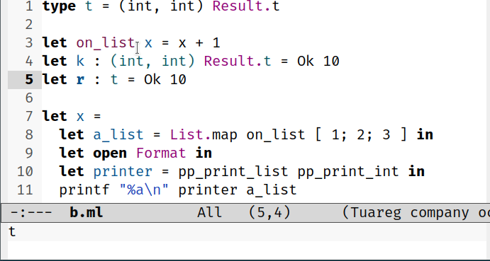
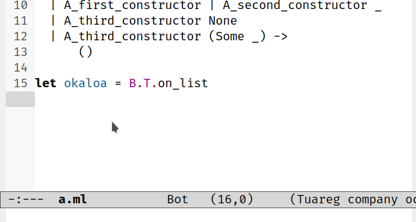
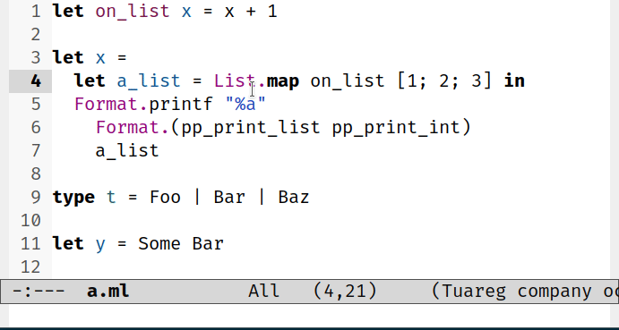
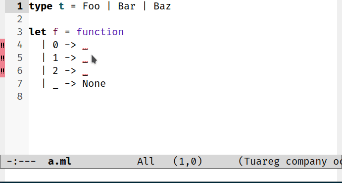
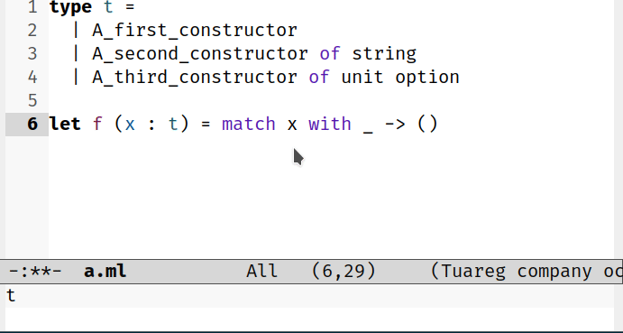
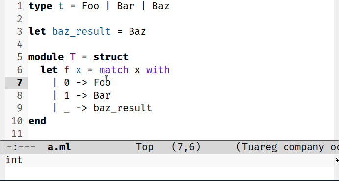
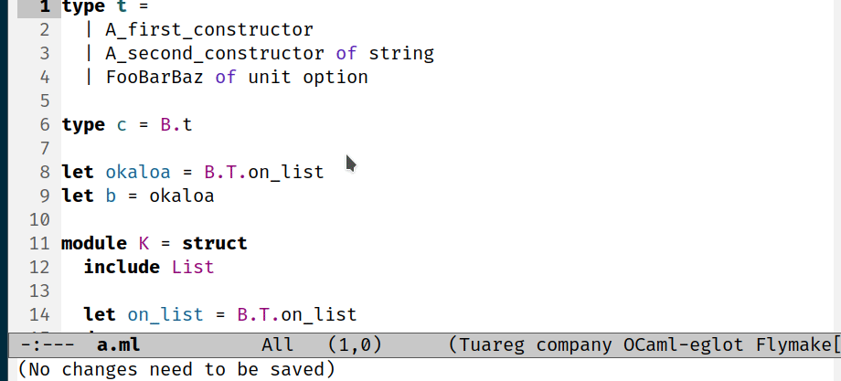

# OCaml-eglot

**`ocaml-eglot`** is a lightweight
[Emacs](https://www.gnu.org/software/emacs/) **minor mode** designed
to enhance the experience of writing OCaml code by leveraging the
[**Eglot**](https://www.gnu.org/software/emacs/manual/html_mono/eglot.html)
[Language Server
Protocol](https://microsoft.github.io/language-server-protocol/) (LSP)
client. This tool specifically caters to the OCaml ecosystem by
implementing canonical custom requests and commands exposed by the
[**`ocaml-lsp-server`**](https://github.com/ocaml/ocaml-lsp).

> [!IMPORTANT]
> `ocaml-eglot` is an **alternative mode** to
> [`merlin`](https://ocaml.github.io/merlin/) which uses
> [`ocaml-lsp-server`](https://github.com/ocaml/ocaml-lsp) (instead of
> `ocamlmerlin`) as the language server. So yes, if you decide to use
> `ocaml-eglot`, `merlin` is no longer needed.

`ocaml-eglot` bridges the gap between generic LSP support and the
**specific needs of OCaml developers**. Its tight coupling with Eglot
ensures a lightweight experience without sacrificing the advanced
features made available by `ocaml-lsp-server`. Its aim is to offer a
user experience as close as possible to that offered by the Emacs mode
[Merlin](https://ocaml.github.io/merlin/editor/emacs/).

## Installation

`ocaml-eglot` is distributed as a [MELPA
package](https://melpa.org/#/ocaml-eglot). `ocaml-eglot` is only an
interface between `eglot` (available _out of the box_ since `emacs >=
29.1`) and Emacs, a major mode dedicated to OCaml editing must be
installed (e.g. [caml-mode](https://melpa.org/#/caml) or
[tuareg](https://melpa.org/#/tuareg)). Then, for example, you can use
[`use-package`](https://www.gnu.org/software/emacs/manual/html_node/use-package/Lisp-Configuration.html)
to install `ocaml-eglot`. You will also need
`https://ocaml.org/p/ocaml-lsp-server/latest` in the [current
switch](https://ocaml.org/docs/opam-switch-introduction).


Here's an example with Tuareg already installed:

```elisp
(use-package ocaml-eglot
  :ensure t
  :after tuareg
  :hook
  (tuareg-mode . ocaml-eglot)
  (ocaml-eglot . eglot-ensure))
```

### Foreword on configuration

`ocaml-eglot` is a minor mode which is grafted onto `eglot` (provided
by default in Emacs since version `29.1`). Since `eglot` is itself
based on several popular packages in the Emacs ecosystem (such as
`xref`, `flymake` `imenu` etc.), you can configure it highly using
these modes. What's more, reading the [Eglot
manual](https://www.gnu.org/software/emacs/manual/html_mono/eglot.html)
is recommended for fine-tuning!

### Activating `format-on-save`

Eglot provides a hook to format the buffer on saving:

```diff
 (use-package ocaml-eglot
   :ensure t
   :after tuareg
   :hook
   (tuareg-mode . ocaml-eglot)
-  (ocaml-eglot . eglot-ensure))
+  (ocaml-eglot . eglot-ensure)
+  (ocaml-eglot . (lambda () 
+                   (add-hook #'before-save-hook #'eglot-format nil t))))
```

### Make eglot less visually obtrusive

Eglot introduces a lot of visual noise (which can greatly alter the
user experience, especially when you're from `merlin`). One way of
reducing this visual obtrusion is to disable type annotations (`eldoc`)
and `inlay-hints`:

```diff
 (use-package ocaml-eglot
   :ensure t
   :after tuareg
   :hook
   (tuareg-mode . ocaml-eglot)
-  (ocaml-eglot . eglot-ensure))
+  (ocaml-eglot . eglot-ensure)
+  (eglot-managed-mode . (lambda () 
+                          (eldoc-mode -1)
+                          (eglot-inlay-hints-mode -1))))
```

You can find more customisation options in the
[Eglot](https://www.gnu.org/software/emacs/manual/html_mono/eglot.html)
manual.

### Using `flycheck` instead of `flymake`

Out of the box, eglot uses `Flymake` as a syntax checker. However, it
is possible to use `flycheck`, via the
[flycheck-eglot](https://github.com/flycheck/flycheck-eglot)
package. If you have `flycheck-eglot` installed, you can change your
configuration in this way:

```diff
+ (use-package flycheck-eglot
+  :ensure t
+  :after (flycheck eglot))

 (use-package ocaml-eglot
   :ensure t
   :after tuareg
   :hook
   (tuareg-mode . ocaml-eglot)
-  (ocaml-eglot . eglot-ensure))
+  (ocaml-eglot . eglot-ensure)
+  (ocaml-eglot . (lambda () (flycheck-eglot-mode 1)))
+  :config
+  (setq ocaml-eglot-syntax-checker 'flycheck))
```

### Using Merlin-configuration

OCaml-lsp-server can use `.merlin` as a configuration template (rather
than configuring via `dune`). This requires the
[`dot-merlin-reader`](https://ocaml.org/p/dot-merlin-reader/latest)
package to be installed in the switch being used, and then `eglot` can be
configured in this way:

```diff
 (use-package ocaml-eglot
   :ensure t
   :after tuareg
   :hook
   (tuareg-mode . ocaml-eglot)
-  (ocaml-eglot . eglot-ensure))
+  (ocaml-eglot . eglot-ensure)
+  :config
+  (with-eval-after-load 'eglot
+    (add-to-list 'eglot-server-programs
+                 '(tuareg-mode . ("ocamllsp" "--fallback-read-dot-merlin")))))
```

## Features

Here is the list of commands offered by `ocaml-eglot`, together with
their key binding (you'll find more detailed descriptions and
illustrations of each command in the next section.).

> [!IMPORTANT]
> This section only covers features specific to `ocaml-eglot`,
> however, Eglot offers a large number of _out of the box_ features,
> via LSP (like completion, xref, flymake backend, imenu). To find out
> more, please consult [its user
> manual](https://www.gnu.org/software/emacs/manual/html_mono/eglot.html).

| Command | Default Binding | 
| -- | -- |
| `ocaml-eglot-error-next` | <kbd>C-c</kbd> <kbd>C-x</kbd> |
| `ocaml-eglot-error-prev` | <kbd>C-c</kbd> <kbd>C-c</kbd> |
| `ocaml-eglot-find-definition` |<kbd>C-c</kbd> <kbd>C-l</kbd> |
| `ocaml-eglot-find-definition-in-new-window` | |
| `ocaml-eglot-find-definition-in-current-window` | |
| `ocaml-eglot-find-identifier-definition` | |
| `ocaml-eglot-find-identifier-definition-in-new-window` | |
| `ocaml-eglot-find-identifier-definition-in-current-window` | |
| `ocaml-eglot-find-declaration` | <kbd>C-c</kbd> <kbd>C-i</kbd> |
| `ocaml-eglot-find-declaration-in-new-window` | |
| `ocaml-eglot-find-definition-in-current-window` | |
| `ocaml-eglot-find-identifier-declaration` | |
| `ocaml-eglot-find-identifier-declaration-in-new-window` | |
| `ocaml-eglot-find-identifier-declaration-in-current-window` | |
| `ocaml-eglot-find-type-definition` | |
| `ocaml-eglot-find-type-definition-in-new-window` | |
| `ocaml-eglot-find-type-definition-in-current-window` | |
| `ocaml-eglot-infer-interface` | |
| `ocaml-eglot-alternate-file` | <kbd>C-c</kbd> <kbd>C-a</kbd> |
| `ocaml-eglot-hole-next` |  |
| `ocaml-eglot-hole-prev` |  |
| `ocaml-eglot-jump` |  |
| `ocaml-eglot-phrase-next` | <kbd>C-c</kbd> <kbd>C-p</kbd> |
| `ocaml-eglot-phrase-prev` | <kbd>C-c</kbd> <kbd>C-n</kbd> |
| `ocaml-eglot-search` | |
| `ocaml-eglot-search-definition` | |
| `ocaml-eglot-search-definition-in-new-window` | |
| `ocaml-eglot-search-definition-in-current-window` | |
| `ocaml-eglot-search-declaration` | |
| `ocaml-eglot-search-declaration-in-new-window` | |
| `ocaml-eglot-search-declaration-in-current-window` | |
| `ocaml-eglot-document` | <kbd>C-c</kbd> <kbd>C-d</kbd> |
| `ocaml-eglot-document-identifier` | |
| `ocaml-eglot-construct` | <kbd>C-c</kbd> <kbd>\\</kbd> |
| `ocaml-eglot-destruct` | <kbd>C-c</kbd> <kbd>\|</kbd> |
| `ocaml-eglot-type-expression` | |
| `ocaml-eglot-type-enclosing` | <kbd>C-c</kbd> <kbd>C-t</kbd> |
| `ocaml-eglot-occurences` | |
| `ocaml-eglot-rename` | |


### Browsing errors

Eglot relies on
[Flymake](https://www.gnu.org/software/emacs/manual/html_node/emacs/Flymake.html)
for error diagnosis. OCaml-eglot offers two functions for quickly
navigating through errors:

- `ocaml-eglot-error-next` (<kbd>C-c</kbd> <kbd>C-x</kbd>): jump to
  the next error
- `ocaml-eglot-error-prev` (<kbd>C-c</kbd> <kbd>C-c</kbd>): jump to
  the previous error


### Type Enclosings

In `ocaml-eglot` one can display the type of the expression below the cursor and
navigate the enclosing nodes while increasing or decreasing verbosity:

- `ocaml-eglot-type-enclosing` (<kbd>C-c</kbd> <kbd>C-t</kbd>):
display the type of the selection and start a "type enclosing" session.

During a "type enclosing" session the following commands are available:

- `ocaml-eglot-type-enclosing-increase-verbosity` (<kbd>C-c</kbd>
  <kbd>C-t</kbd> or <kbd>C-→</kbd>): to increase the verbosity of the
  type observed
- `ocaml-eglot-type-enclosing-decrease-verbosity` (<kbd>C-←</kbd>): to
  decrease verbosity of the type observed
- `ocaml-eglot-type-enclosing-grow` (<kbd>C-↑</kbd>): to grow the
  expression
- `ocaml-eglot-type-enclosing-shrink` (<kbd>C-↓</kbd>): to shrink the
  expression
- `ocaml-eglot-type-enclosing-copy` (<kbd>C-w</kbd>): to copy the
  type expression to the _kill-ring_ (clipboard)
  
You can also enter an expression in the mini-buffer for which you want
to display the type:
  
- `ocaml-eglot-type-expression` (<kbd>C-u</kbd> <kbd>C-c</kbd> <kbd>C-t</kbd>)
  



### Jump to definition/declaration

`ocaml-eglot` provides a shortcut to quickly jump to the definition or
declaration of an identifier:

- `ocaml-eglot-find-definition` (<kbd>C-c</kbd> <kbd>C-l</kbd>): jump to
  definition (the implementation)
  
- `ocaml-eglot-find-declaration` (<kbd>C-c</kbd> <kbd>C-i</kbd>): jump to
  declaration (the signature)


The default calculation for the window containing the jump result is
_smart_: if the target is in the same file, the command uses the same
window; if the target is in another file, the command opens a new
window. Auxiliary functions for controlling the placement of a result
are provided:

- `ocaml-eglot-find-definition-in-new-window`
- `ocaml-eglot-find-declaration-in-new-window`
- `ocaml-eglot-find-definition-in-current-window`
- `ocaml-eglot-find-declaration-in-current-window`

The default behavior can also be configured using the
`ocaml-eglot-open-window-strategy` variable.

#### Definition and Declaration

In `LSP`, the terminology between `definition` and `declaration` can
be confusing:

- `definition`: corresponds to the implementation
- `declaration`: corresponds to the signature

### Find identifier definition/declaration

It is also possible to directly enter the name of an identifier
(definition or declaration) using the following commands:

- `ocaml-eglot-find-identifier-definition`
- `ocaml-eglot-find-identifier-declaration`



And as with commands that locate the identifier below the cursor,
there are variations for controlling the window to jump to:

- `ocaml-eglot-find-identifier-definition-in-new-window`
- `ocaml-eglot-find-identifier-definition-in-current-window`
- `ocaml-eglot-find-identifier-declaration-in-new-window`
- `ocaml-eglot-find-identifier-declaration-in-current-window`

### Jump to type definition  of an expression

You can also jump to the type definition of the expression at point.



Auxiliary functions for controlling the placement of a result are
provided:

- `ocaml-eglot-find-type-definition-in-new-window`
- `ocaml-eglot-find-type-definition-in-current-window`

### Find occurrences

`ocaml-eglot-occurences` returns all occurrences of the
identifier under the cursor. To find all occurrences in the entire
project, it requires an index. This index can be created by running
`dune build @ocaml-index --watch` when developing.  Requires OCaml
`5.2` and Dune `3.16.0`. See the
[announcement](https://discuss.ocaml.org/t/ann-project-wide-occurrences-in-merlin-and-lsp/14847/1).



### Renaming

Use `ocaml-eglot-rename` to rename the symbol under the
cursor. Starting with OCaml 5.3 it is possible to rename a symbol
across multiple files after building an up-to-date index with `dune
build @ocaml-index`.


### Infer Interface

Used to infer the type of an interface file. If the buffer is not
empty, a prompt will ask for confirmation to overwrite the buffer
contents:

- `ocaml-eglot-infer-interface`: infer the interface for the current implementation file


### Find Alternate file

OCaml-eglot allows you to quickly switch from the implementation file
to the interface file and vice versa. If the interface file does not
exist, a prompt can be used to generate it (using type inference,
based on `ocaml-eglot-infer-interface`):

- `ocaml-eglot-alternate-file` (<kbd>C-c</kbd> <kbd>C-a</kbd>): switch
  from the implementation file to the interface file and vice versa


### Get Documentation

Although the `Hover` primitive in the LSP protocol can be used to
conveniently display the documentation of a value, it is also possible to query for it
explicitly:

- `ocaml-eglot-document` (<kbd>C-c</kbd> <kbd>C-d</kbd>): documents
  the expression below the cursor.
- `ocaml-eglot-document-identifier`: enables you to enter an
  identifier (present in the environment) and return its
  documentation.



### Construct Expression

Enables you to navigate between typed-holes (`_`) in a document and
interactively substitute them:

- `ocaml-eglot-hole-next`: jump to the next hole
- `ocaml-eglot-hole-prev`: jump to the previous hole
- `ocaml-eglot-construct`: open up a list of valid substitutions to
  fill the hole



If the `ocaml-eglot-construct` (<kbd>C-c</kbd> <kbd>\\</kbd>) command
is prefixed by an argument, i.e.: `C-u M-x ocaml-eglot-construct`, the
command will also search for valid candidates in the current
environment:


### Destruct (or case-analysis)

Destruct, `ocaml-eglot-destruct` (<kbd>C-c</kbd> <kbd>|</kbd>) is a
powerful feature that allows one to generate and manipulate pattern
matching expressions. It behaves differently depending on the cursor’s
context:

- on an expression: it replaces it by a pattern matching over it’s
  constructors
- on a wildcard pattern: it will refine it if possible
- on a pattern of a non-exhaustive matching: it will make the pattern
  matching exhaustive by adding missing cases



### Source Browsing

OCaml-eglot allows you to navigate semantically in a buffer, passing
from an expression to the parent `let`, the parent `module`, the
parent `fun` and the parent `match` expression. It is also possible to
navigate between pattern matching cases:

- `ocaml-eglot-jump`: jumps to the referenced expression
- `ocaml-eglot-phrase-prev` (<kbd>C-c</kbd> <kbd>C-p</kbd>): jump to
  the beginning of the previous phrase
- `ocaml-eglot-phrase-next` (<kbd>C-c</kbd> <kbd>C-n</kbd>): jump to
  the beginning of the next phrase



### Search for values

Search for values using a _by polarity_ query or a type expression. A
polarity query prefixes the function arguments with `-` and the return
with `+`. For example, to search for a function of this type: `int ->
string`. Search for `-int +string`. Searching by polarity does not
support type parameters. A search by type (modulo isomorphisms) uses a
query closer to what you would write to describe a type. For example,
to find the function `int_of_string_opt`, search for `string -> int
option`:

- `ocaml-eglot-search` searches for a value by its type or polarity to
  included in the current buffer (the search type is defined by the
  input query)
  


Alternatively, you can search for a definition or declaration:
  
- `ocaml-eglot-search-definition` searches for a value definition by 
  its type or polarity
  
- `ocaml-eglot-search-declaration` searches for a value declaration by 
  its type or polarity
  


And as with commands that locate the identifier below the cursor,
there are variations for controlling the window to jump to:
  
- `ocaml-eglot-search-definition-in-current-window`
- `ocaml-eglot-search-definition-in-new-window`
- `ocaml-eglot-search-declaration-in-current-window`
- `ocaml-eglot-search-declaration-in-new-window`


## Comparison of Merlin and OCaml-eglot commands

| `merlin`                    | `ocaml-eglot`                      | Note                                                                                                         |
|-----------------------------|------------------------------------|--------------------------------------------------------------------------------------------------------------|
| `merlin-error-check`        | —                                  | The functionality is supported by `eglot` diagnostics (via LSP).                                             |
| `merlin-error-next`         | `ocaml-eglot-error-next`           |                                                                                                              |
| `merlin-error-prev`         | `ocaml-eglot-error-prev`           |                                                                                                              |
| `merlin-type-enclosing`     | `ocaml-eglot-type-enclosing`       |                                                                                                              |
| `merlin-type-expr`          | `ocaml-eglot-type-expression`      |                                                                                                              |
| `merlin-locate`             | `ocaml-eglot-find-declaration`     |                                                                                                              |
|  —                          | `ocaml-eglot-find-definition`      | Available in Merlin by configuration                                                                         |
| ❌                          | `ocaml-eglot-find-type-definition` |                                                                          |
| `merlin-locate-ident`       | `ocaml-eglot-find-identifier-definition`, `ocaml-eglot-find-identifier-declaration`                                 |                                                                                                              |
| `merlin-occurences`         | `ocaml-eglot-occurences`           |                                                                                                              |
| `merlin-project-occurences` | —                                  | Handle by `ocaml-eglot-occurences` (if `ocaml-version  >= 5.2` and need an index, `dune build @ocaml-index`) |
| `merlin-iedit-occurrences`  | `ocaml-eglot-rename`               |                                                                                                              |
| `merlin-document`           | `ocaml-eglot-document`             | also `ocaml-eglot-document-identifier`                                                                       |
| `merlin-phrase-next`        | `ocaml-eglot-phrase-next`          |                                                                                                              |
| `merlin-phrase-prev`        | `ocaml-eglot-phrase-prev`          |                                                                                                              |
| `merlin-switch-to-ml`       | `ocaml-eglot-alternate-file`       |                                                                                                              |
| `merlin-switch-to-mli`      | `ocaml-eglot-alternate-file`       |                                                                                                              |
| ❌                          | `ocaml-eglot-infer-interface`      | It was supported by `Tuareg` (and a bit ad-hoc)                                                              |
| `merlin-jump`               | `ocaml-eglot-jump`                 |                                                                                                              |
| `merlin-destruct`           | `ocaml-eglot-destruct`             |                                                                                                              |
| `merlin-construct`          | `ocaml-eglot-construct`            |                                                                                                              |
| `merlin-next-hole`          | `ocaml-eglot-hole-next`            |                                                                                                              |
| `merlin-previous-hole`      | `ocaml-eglot-hole-prev`            |                                                                                                              |
| `merlin-toggle-view-errors` | —                                  | An `eglot` configuration                                                                                     |
